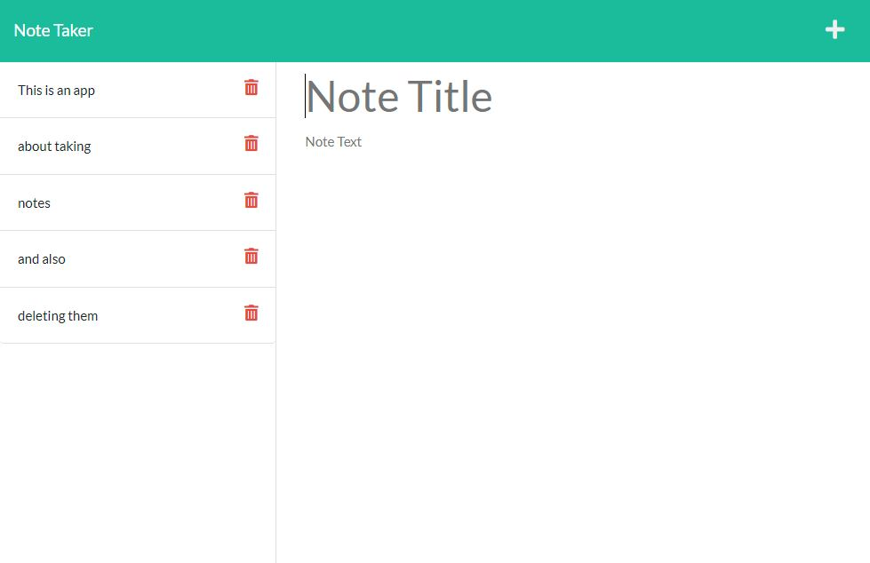

# Note Taker

An app that allows a user to write, save and delete notes.

## Installation

1. Download or Clone this repository.
2. Node.js is required to run this application.
3. `npm install` in terminal to install all required dependencies.

## Usage

* To invoke this application use this command:

    `npm run start`

* Terminal will show that the server started.

* In your browser, go to the URL:

    `http://localhost:3000/`

* You should see this: 
    

   * [Deployed Application](https://powerful-everglades-51474.herokuapp.com/)

## Features

* Javascript
* Node.js
* npm
* Express

## License

Copyright (c) BoiledLettuce. All rights reserved.